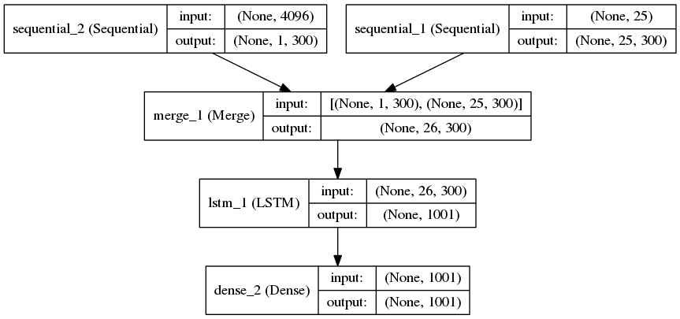
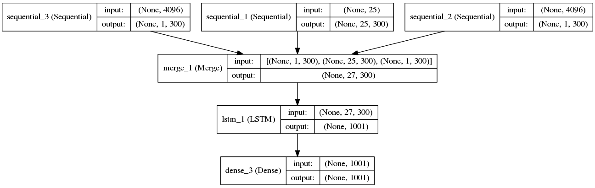

# Visual Question Answering

This is a python and keras implementation of the VIS+LSTM visual question answering model. This model is explained in the paper [Exploring Models and Data for Image Question Answering](https://arxiv.org/abs/1505.02074). A second model is also implemented which is similar to the 2-VIS+BLSTM model from the paper mentioned above except that the LSTMs are not bidirectional. 
This model has two image feature inputs, at the start and the end of the sentence, with different learned linear transformations. We call it 2-VIS+LSTM. 

Details about the dataset are explained at the [VisualQA website](http://www.visualqa.org/). 

Here is a summary of performance we obtained on both the models.

| Model      | Epochs | Batch Size | Validation Accuracy |
|------------|--------|------------|---------------------|
| VIS+LSTM   | 10     | 200        | 53.27%              |
| 2-VIS+LSTM | 10     | 200        | 54.01%              |

## Requirements

* Python 2.7
* Numpy
* Scipy (for loading pre-computed MS COCO features)
* NLTK (for tokenizer)
* Keras
* Theano

## Training

* The basic usage is `python train.py`. 

* The model to train can be specified using the option `-model`. For example, to train the VIS+LSTM model enter `python train.py -model=1`. Similarly, the 2-VIS+LSTM model can be trained using `python train.py -model=2`. If no model is specified, model 1 is selected.

* The batch size and the number of epochs can also be specified using the options `-num_epochs` and `-batch_size`. The default batch size and number of epochs are 200 and 25 respectively.

* To train 2-VIS+LSTM with a batch size of 100 for 10 epochs, we would use: `python train.py -model=2 -batch_size=100 -num_epochs=10`.

## Models

### VIS+LSTM

### 2-VIS+LSTM

## Prediction

* Q&A can be performed on any image using the script `question_answer.py`.

* The options `-question` and `-image` are used to specify the question and address of the image respectively. The model to use for the prediction can be specified using `-model`. By default, model 2 is selected.

* An example of usage is: `python question_answer.py -image="examples/COCO_val2014_000000000136.jpg" -question="Which animal is this?" -model=2`

Here are some examples of predictions using the 2-VIS+LSTM model.

| Image                                              | Question                   | Top Answers (left to right) |
|----------------------------------------------------|----------------------------|-----------------------------|
|  | Which animal is this?      | giraffe, cat, bear          |
|  | Which vehicle is this?     | motorcycle, taxi, train     |
|  | How many dishes are there? | 5, 3, 2                     |
|  | What is in the bottle?     | water, beer, wine           |
|  | Which sport is this?       | tennis, baseball, frisbee   |

